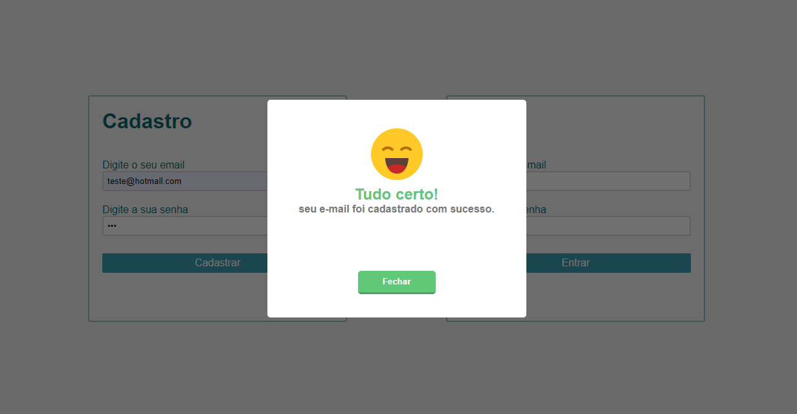
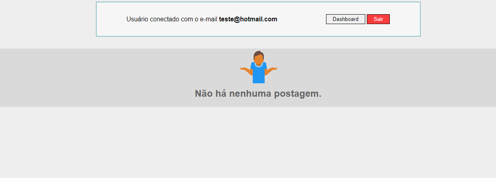
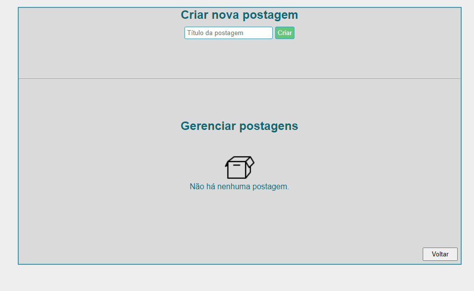

<h1 align="center"> 🚧 Projeto em desenvolvimento 🚧</h1>

# Sobre

Estou desenvolvendo esse projeto com o objetivo de desenvolver um sistema backend mais robusto com verificações, autenticações e entender melhor sobre como o frontend precisa receber as informações e lidar com elas. Além disso, praticar o uso de padrão de arquitetura para criar um código mais organizado

Para isso, estou usando no frontend **HTML, CSS e Javascript**. Para o backend: **NodeJS, ExpressJS e MySQL**, além de algumas bibliotecas: **bcrypt, jsonwebtoken e sequelize**

# Demonstração

<h3 align="center">👉 Após realizar o cadastro de usuário</h3>

---
<h3 align="center">👉 Após o login, você irá ver essa tela que irá mostrar todas as postagens criadas</h3>

---
<h3 align="center">👉 Clicando no "dashboard" visto na imagem anterior, você pode criar e gerenciar postagens</h3>

